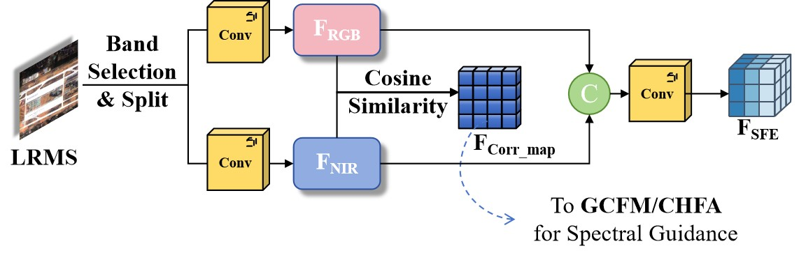

# NIRFreqNet: A Frequency-Aware and Correlation-Guided Network for Remote Sensing Pansharpening

This repository contains the official PyTorch implementation of **NIRFreqNet**, a deep learning framework designed for high-fidelity pansharpening. By integrating frequency-domain modeling with RGB-NIR cross-modal correlation guidance, NIRFreqNet achieves a superior balance between spatial detail injection and spectral fidelity.

---

## 🚀 Network Architecture

### Overall Framework
The overall architecture of NIRFreqNet. It explicitly decouples RGB and NIR streams to establish pixel-wise spectral correlation maps, and utilizes a Frequency-Aware Gated Cross-Fusion Module (GCFM) to integrate static high-frequency priors with dynamic convolutions.

  
   
  <i><b>Fig. 1</b>: Overview structure of NIRFreqNet. Spectral correlation cues, Laplacian-based high-frequency priors, and dynamically generated filters are jointly exploited to enhance spatial–spectral representation.</i>

### Shallow Feature Extractor (SFE)
The SFE module is designed to extract structural priors from RGB channels and incorporate unique high-frequency cues from the NIR band.

  
   
  <i><b>Fig. 2</b>: Architecture of the Shallow Feature Extractor (SFE) module. It calculates a pixel-wise cosine similarity map to encode spectral dependencies, serving as a global prior for subsequent fusion.</i>

---

## 🗄️ Datasets

The original benchmark datasets (GF-1, IKONOS, and WorldView-2) used for training and evaluating this framework are publicly accessible. You can download the complete dataset from the following repository:

🔗 **[NBU_PansharpRSData](https://github.com/starboot/NBU_PansharpRSData)**

---

## 📊 Visual Results

Our proposed NIRFreqNet is evaluated on three benchmark satellite datasets (GF-1, IKONOS, and WorldView-2) under both reduced-resolution and full-resolution conditions. It consistently preserves sharper edges and more coherent textures without introducing noticeable spectral distortion.

### 1. Reduced-Resolution Experiments
Reduced-resolution visual comparisons and their corresponding Mean Absolute Error (MAE) maps. The error distributions demonstrate our model's superiority in minimizing spectral distortion while maintaining clear structural boundaries.

  
   
  <i><b>GF-1 Dataset</b>: Fused images, magnified rectangular patches, and corresponding MAE maps (blue indicates lower error).</i>

  
   
  <i><b>IKONOS Dataset</b>: Fused images, magnified rectangular patches, and corresponding MAE maps.</i>

  
   
  <i><b>WorldView-2 Dataset</b>: Fused images, magnified rectangular patches, and corresponding MAE maps.</i>

### 2. Full-Resolution Experiments
Full-resolution qualitative comparisons demonstrating superior structural preservation in diverse and complex real-world land-cover scenes.

  
   
  <i><b>GF-1 Dataset (Waterbody Scenes)</b>: NIRFreqNet accurately reconstructs water boundaries and fine ripples.</i>

  
   
  <i><b>IKONOS Dataset (Vegetation Scenes)</b>: Superior preservation of natural spectral appearance and canopy textures.</i>

  
   
  <i><b>WorldView-2 Dataset (Urban Scenes)</b>: Accurate reconstruction of regular geometric structures such as building edges and rooftop boundaries.</i>

---

## 🌍 Downstream Applications

To validate the practical utility of the fused images, downstream tasks were conducted using the pansharpened products. The results demonstrate that NIRFreqNet effectively facilitates the transition of pansharpening toward application-oriented preprocessing for Earth sciences.

### Waterbody Extraction (NDWI)

  
   
  <i><b>Water Extraction</b>: Evaluated using NDWI. In the difference maps (bottom rows), green indicates True Positives, red indicates False Positives, and blue indicates False Negatives.</i>

### Forest Monitoring (NDVI)

  
   
  <i><b>Forest Extraction</b>: Evaluated using NDVI. The explicit RGB-NIR decoupling in our network prevents spectral contamination in critical vegetation bands.</i>

