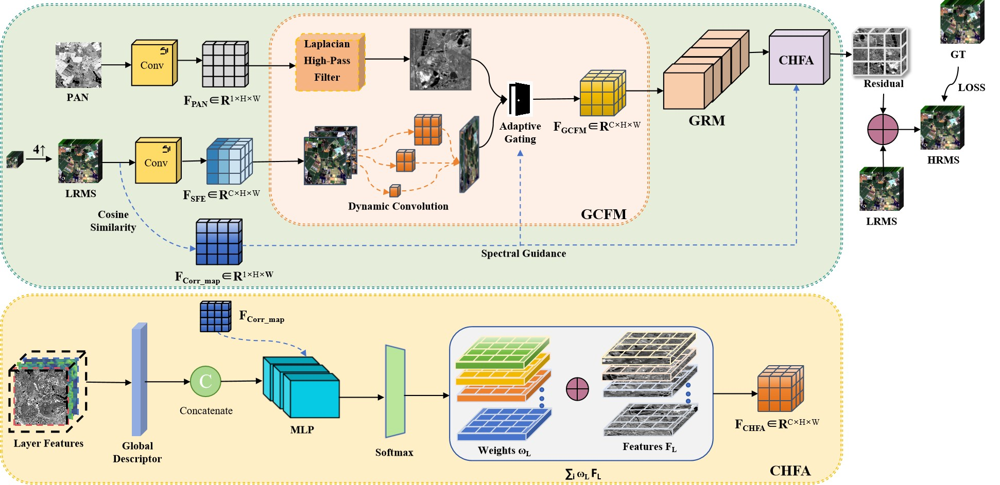
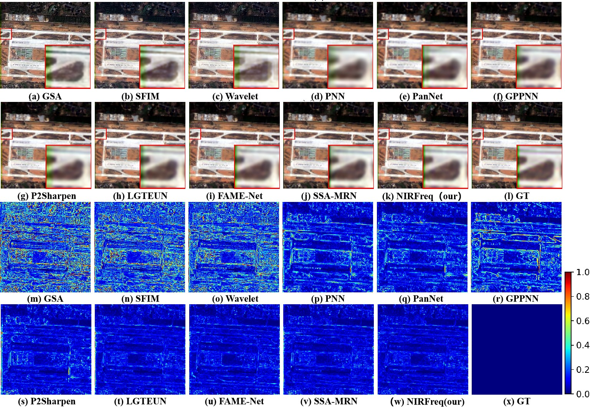
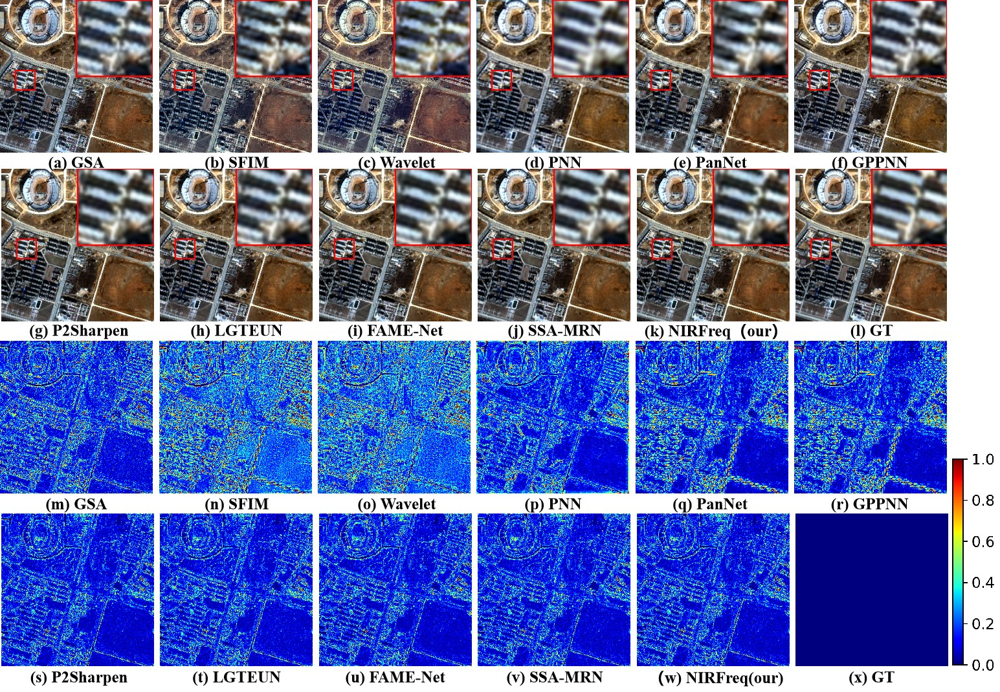
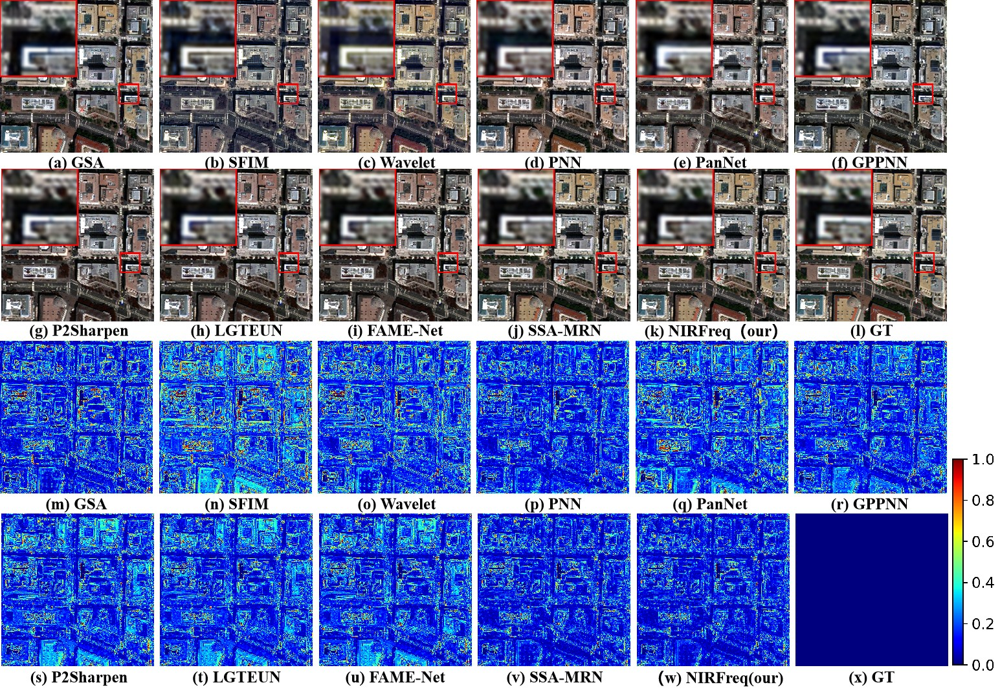
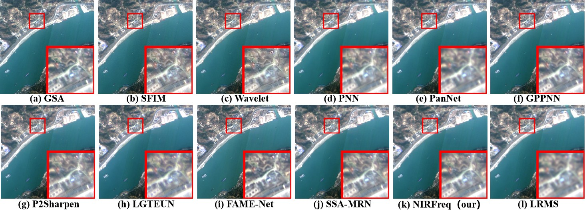
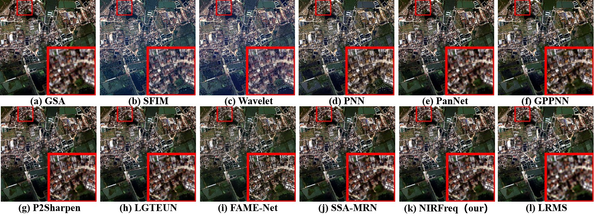
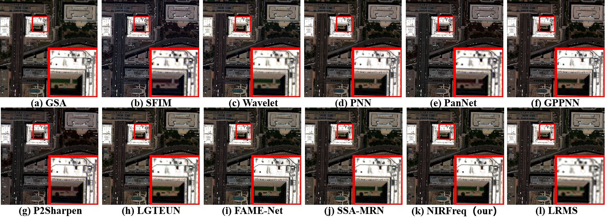
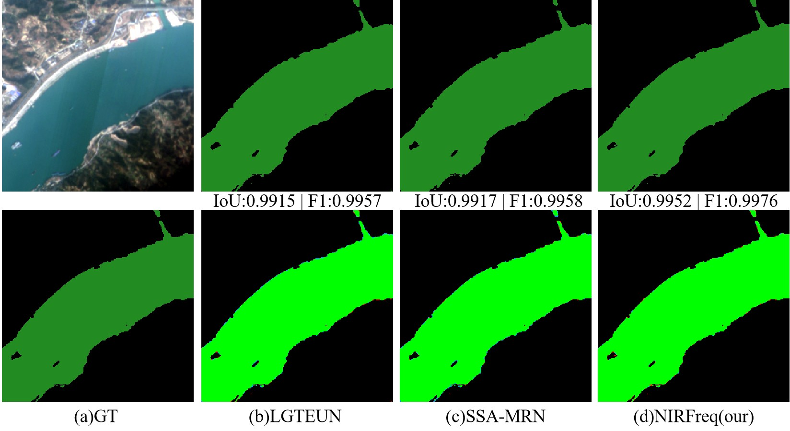
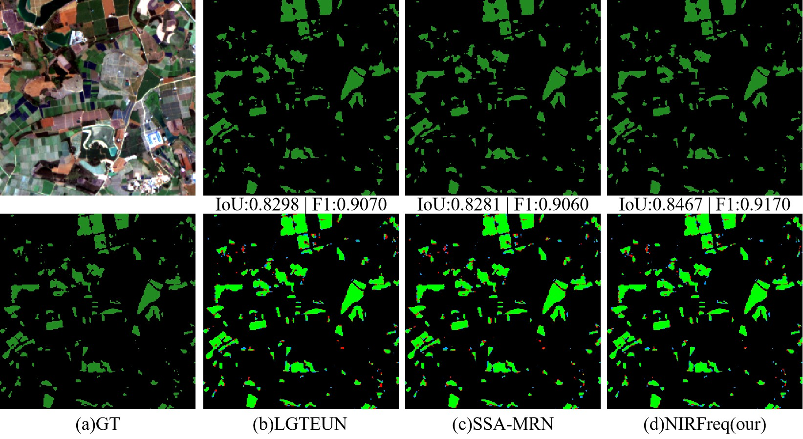

# NIRFreqNet: A Frequency-Aware and Correlation-Guided Network for Remote Sensing Pansharpening

This repository contains the official PyTorch implementation of **NIRFreqNet**, a deep learning framework designed for high-fidelity pansharpening. By integrating frequency-domain modeling with RGB-NIR cross-modal correlation guidance, NIRFreqNet achieves a superior balance between spatial detail injection and spectral fidelity.

## 🚀 Network Architecture

The overall architecture of NIRFreqNet. It explicitly decouples RGB and NIR streams to establish pixel-wise spectral correlation maps, and utilizes a Frequency-Aware Gated Cross-Fusion Module (GCFM) to integrate static high-frequency priors with dynamic convolutions.

  

---

## 📊 Visual Results

Our proposed NIRFreqNet is evaluated on three benchmark satellite datasets (GF-1, IKONOS, and WorldView-2) under both reduced-resolution and full-resolution conditions. It consistently preserves sharper edges and more coherent textures without introducing noticeable spectral distortion.

### 1. Reduced-Resolution Experiments
Visual comparisons and corresponding Mean Absolute Error (MAE) maps on the GF-1, IKONOS, and WorldView-2 datasets.

  <b>GF-1 Dataset</b> 
  

  <b>IKONOS Dataset</b> 
  

  <b>WorldView-2 Dataset</b> 
  

### 2. Full-Resolution Experiments
Full-resolution qualitative comparisons demonstrating superior structural preservation in complex scenes.

  <b>GF-1 Dataset</b> 
  

  <b>IKONOS Dataset</b> 
  

  <b>WorldView-2 Dataset</b> 
  

---

## 🌍 Downstream Applications

To validate the practical utility of the fused images, downstream tasks were conducted using the pansharpened products. The results demonstrate that NIRFreqNet effectively facilitates the transition of pansharpening toward application-oriented preprocessing for Earth sciences.

### Waterbody Extraction (NDWI)
Downstream water extraction using the Normalized Difference Water Index on the GF-1 dataset.

  

### Forest Monitoring (NDVI)
Downstream forest area extraction using the Normalized Difference Vegetation Index on the GF-1 dataset.

  

---
**Note:** The complete source code and pre-trained models will be released here upon publication.
